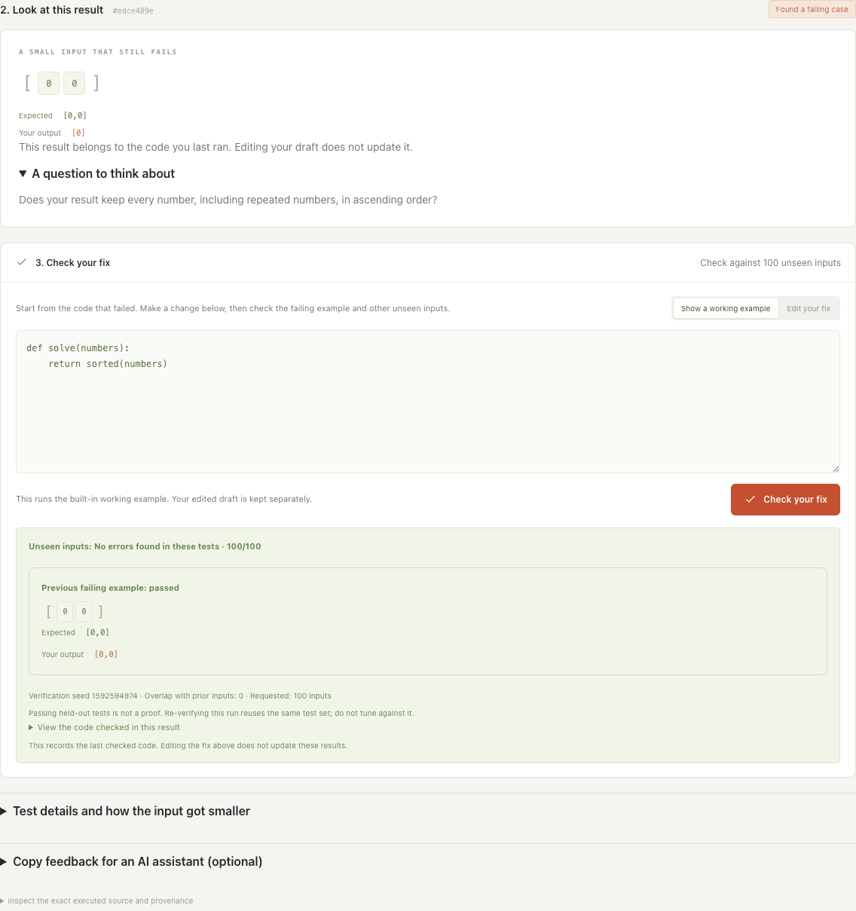
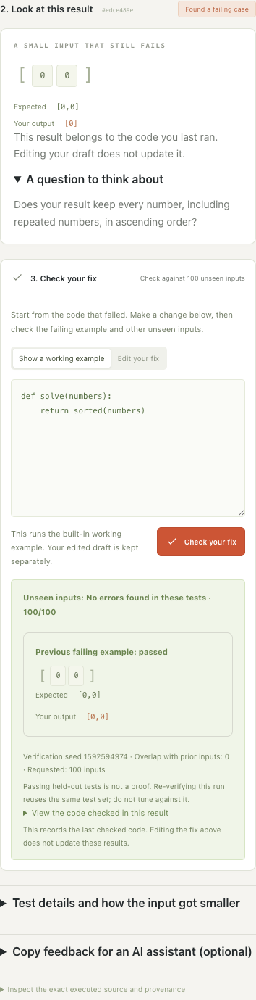

# Find My Bug

Find My Bug helps you find a small input that your Python code gets wrong. Compare the expected answer with your output, change your code, and check the fix.

It currently supports three practice problems: sorting, binary search, and maximum subarray. Built-in examples work without Docker; running your own code needs Docker.


## An example

This function returns a sorted list, but removes repeated values:

```python
def solve(numbers):
    return sorted(set(numbers))
```

For `[0, 0]`, the expected result is `[0, 0]`. The function returns `[0]`.

The sorting demo uses this bug to show how reduction works. Removing either element makes the test pass, so the remaining pair makes the problem easy to explain.

Below, **Show a working example** checks `sorted(numbers)`: the old failing input passes, along with 100 unseen inputs. This is a built-in demonstration, not a claim that every input will pass.



<details>
<summary>See the same demo on a narrow screen</summary>



</details>

See the [demo walkthrough](docs/DEMO.md) to reproduce these screens.

This duplicate-removal example also appears in the [Hypothesis README](https://github.com/HypothesisWorks/hypothesis#readme). Find My Bug implements its own task-specific test generation and reduction logic.

## Run locally

You need Python 3.11+ and Node.js 22.12+ with npm.

```sh
git clone https://github.com/yaa711/find-my-bug.git
cd find-my-bug

npm --prefix frontend ci
npm --prefix frontend run build
python3 -m backend.server
```

Open [http://127.0.0.1:8765](http://127.0.0.1:8765).

The Python backend uses the standard library. You can try the built-in examples without Docker:

1. Select **Array sorting** and the buggy built-in example.
2. Click **Find a failing case**.
3. Compare **Expected** with **Your output** in the failing example.
4. Select **Show a working example**, then **Check your fix** to try the checking workflow without Docker.

## Test your own code

Start Docker and build the runner image from the repository root:

```sh
docker build -t counterexample-lab-runner:1 runner
```

Choose **Your code** in the interface and paste a complete `solve` function. The runner includes the Python standard library.

| Task | Function | Expected behavior |
|---|---|---|
| Sorting | `solve(numbers)` | Return an ascending list, preserving duplicates. |
| Binary search | `solve(numbers, target)` | Return the first matching index in a sorted list, or `-1`. |
| Maximum subarray | `solve(numbers)` | Return the largest sum of a non-empty contiguous subarray. |

Each evaluation runs in a separate container with networking disabled, a read-only filesystem, no host mounts, and limits on memory, execution time, and output size. Pasted code is never executed directly by the backend.

Custom execution supports macOS, Linux, and WSL2. Keep the server on localhost; this project is intended for local use and is not designed to host code execution for public users.

## How reduction works

The engine generates boundary cases and seeded random inputs, then compares the candidate's output with a reference implementation.

For a repeatable wrong answer, it tries removing chunks of the array, removing individual elements, and simplifying values. It accepts a change only if the input remains valid, the failure repeats, and the input becomes smaller under the reduction measure.

The result depends on the available transformations and the execution budget. It is not guaranteed to be the smallest possible failing input. Exceptions and timeouts are reported separately from incorrect outputs.

The reference implementations favor simplicity. For example, the maximum-subarray oracle checks every non-empty subarray instead of reusing the candidate's dynamic-programming recurrence. This helps avoid repeating the same mistake on both sides of a test.

## Compare reduction strategies

Open **Advanced settings** to choose single-element deletion or block deletion. Both use the same value simplification and failure-confirmation rules. Choose **Evaluation** to generate seeded inputs without the long teaching examples. The result records the strategy actually executed, even if you change the settings afterward.

Open **Test details and how the input got smaller**, then expand **All reduction attempts** to inspect accepted proposals, rejected outputs, skipped inputs, and confirmation calls. The trace also records complexity before and after reduction. It describes the reducer's decisions, not individual lines of candidate code.

For a paired comparison from the same initial failure, use the Docker benchmark:

```sh
python3 -m benchmarks.compare --seeds 7 42 --count 12 --budget 30 --seconds 90 --output artifacts/comparison.json
python3 -m benchmarks.summarize artifacts/comparison.json
```

The first pilot found failures in 16 of 18 faulty-program/seed trials; six correct-control trials passed. Across the 16 audited pairs, single deletion used 317 reduction calls and block deletion used 265. Some runs exhausted the budget, and one faulty program was missed under both seeds. This is a small hand-written fixture set, not a general performance benchmark.

See the [method, limitations, and raw results](benchmarks/README.md) before interpreting the numbers.

## Checking a repair

The fix editor starts with the code from your last run. Edit it and click **Check your fix**. The app rechecks the displayed failing input, then runs a separate set of unseen inputs. Those results are reported separately: passing the old example alone does not mean the fix works elsewhere.

Your edited code runs in Docker. **Show a working example** runs the built-in correct function instead and keeps your draft intact.

The unseen set excludes inputs used during discovery and reduction. Repeating a check on the same run reuses that set, so it is not fresh evidence after repeated attempts to tune a fix.

Optional copyable prompts are under **Copy feedback for an AI assistant**. The app does not make model API calls.

The built-in candidates are teaching examples. No model-repair study is included yet. The [experiment protocol](docs/EXPERIMENTS.md) describes how to compare feedback conditions across independently generated candidate programs.

Passing the tests does not prove that a function is correct.

## Exporting results

Use **Export results** to save the candidate source, source hash, seeds, tested inputs, reduction steps, feedback prompts, and verification result.

The server keeps at most 24 reports in memory, with a one-hour lifetime. Export a report before restarting the server or leaving it to expire. This version does not import saved reports.

## Development

For frontend development, run these commands in separate terminals from the repository root:

```sh
python3 -m backend.server
```

```sh
npm --prefix frontend run dev
```

The development interface runs at [http://127.0.0.1:5173](http://127.0.0.1:5173).

Run the backend tests:

```sh
python3 -m unittest discover -s tests -v
```

Run the Docker integration tests after building the runner image:

```sh
LAB_DOCKER_TESTS=1 python3 -m unittest discover -s tests -v
```

Build the frontend and run the browser tests:

```sh
npm --prefix frontend run build
cd frontend
npx playwright install chromium
npm run test:e2e
```

To build a ZIP with source and the compiled interface, run `python3 scripts/package.py` after building the frontend. The output is `artifacts/find-my-bug.zip`.

## Code layout

- `backend/tasks.py`: task contracts, reference implementations, and demo functions.
- `backend/engine.py`: test generation, failure reduction, and repair verification.
- `backend/execution.py`: Docker execution and resource limits.
- `backend/server.py`: the local HTTP API.
- `backend/reports.py`: experiment records and feedback prompts.
- `frontend/src/`: the React and TypeScript interface.
- `runner/`: the container image and candidate worker.
- `tests/` and `frontend/e2e/`: backend and browser tests.
- `benchmarks/`: fault fixtures, Docker-only paired experiments, and saved pilot results.
