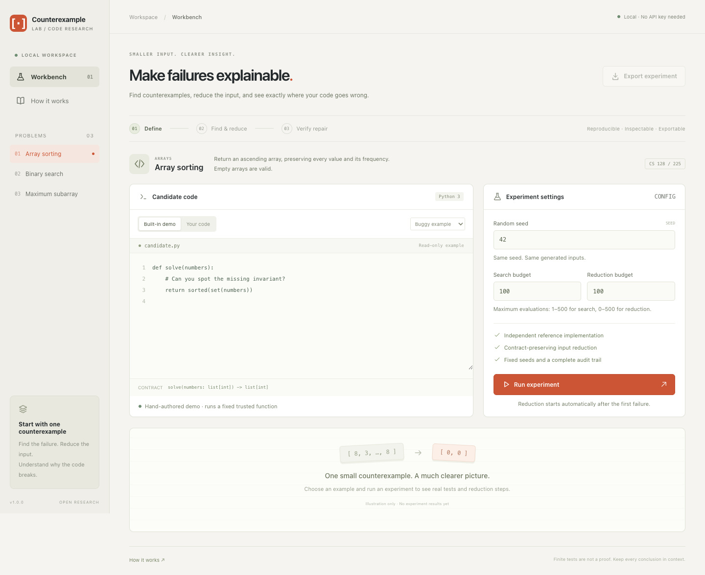

# Counterexample Lab

Counterexample Lab tests small Python algorithms against reference implementations. When an output is wrong, it tries to simplify the input while keeping the failure, so there is less to inspect.

The web interface shows the original failure and the steps taken to reduce it. You can also paste a repaired function, check it on held-out inputs, and export the experiment as JSON.



## An example

This function returns a sorted list, but removes repeated values:

```python
def solve(numbers):
    return sorted(set(numbers))
```

For `[0, 0]`, the expected result is `[0, 0]`. The function returns `[0]`.

The sorting demo uses this bug to show how reduction works. Removing either element makes the test pass, so the remaining pair makes the problem easy to explain.

This duplicate-removal example also appears in the [Hypothesis README](https://github.com/HypothesisWorks/hypothesis#readme). Counterexample Lab implements its own task-specific test generation and reduction logic.

## Run locally

You need Python 3.11+ and Node.js 22.12+ with npm.

```sh
git clone https://github.com/yaa711/counterexample-lab.git
cd counterexample-lab

npm --prefix frontend ci
npm --prefix frontend run build
python3 -m backend.server
```

Open [http://127.0.0.1:8765](http://127.0.0.1:8765).

The Python backend uses the standard library. You can try the built-in examples without Docker:

1. Select **Array sorting** and the buggy built-in example.
2. Click **Run experiment**.
3. Compare the expected and actual outputs, then inspect the reduction steps.
4. Try the correct demo to check the repair-verification workflow.

## Test your own code

Start Docker and build the runner image from the repository root:

```sh
docker build -t counterexample-lab-runner:1 runner
```

Choose **Your code** in the interface and paste a complete `solve` function. The runner includes the Python standard library.

| Task | Function | Expected behavior |
|---|---|---|
| Sorting | `solve(numbers)` | Return an ascending list, preserving duplicates. |
| Binary search | `solve(numbers, target)` | Return the first matching index in a sorted list, or `-1`. |
| Maximum subarray | `solve(numbers)` | Return the largest sum of a non-empty contiguous subarray. |

Each evaluation runs in a separate container with networking disabled, a read-only filesystem, no host mounts, and limits on memory, execution time, and output size. Pasted code is never executed directly by the backend.

Custom execution supports macOS, Linux, and WSL2. Keep the server on localhost; this project is intended for local use and is not designed to host code execution for public users.

## How reduction works

The engine generates boundary cases and seeded random inputs, then compares the candidate's output with a reference implementation.

For a repeatable wrong answer, it tries removing chunks of the array, removing individual elements, and simplifying values. It accepts a change only if the input remains valid, the failure repeats, and the input becomes smaller under the reduction measure.

The result depends on the available transformations and the execution budget. It is not guaranteed to be the smallest possible failing input. Exceptions and timeouts are reported separately from incorrect outputs.

The reference implementations favor simplicity. For example, the maximum-subarray oracle checks every non-empty subarray instead of reusing the candidate's dynamic-programming recurrence. This helps avoid repeating the same mistake on both sides of a test.

## Checking a repair

After finding a failure, the interface prepares three kinds of feedback:

- A message that the code failed a test.
- The original failing input with expected and actual outputs.
- The reduced input with expected and actual outputs.

You can copy a prompt into a separate LLM conversation and paste the proposed repair back into the app. The app does not make model API calls.

Verification uses inputs that were not exposed during discovery or reduction. Repeating verification on the same experiment reuses that set, so it should not be treated as fresh evidence after repeated attempts to tune a repair.

The built-in candidates are teaching examples. No model-repair study is included yet. The [experiment protocol](docs/EXPERIMENTS.md) describes how to compare feedback conditions across independently generated candidate programs.

Passing the tests does not prove that a function is correct.

## Exporting results

Use **Export experiment** to save the candidate source, source hash, seeds, tested inputs, reduction steps, feedback prompts, and verification result.

The server keeps at most 24 reports in memory, with a one-hour lifetime. Export a report before restarting the server or leaving it to expire. This version does not import saved reports.

## Development

For frontend development, run these commands in separate terminals from the repository root:

```sh
python3 -m backend.server
```

```sh
npm --prefix frontend run dev
```

The development interface runs at [http://127.0.0.1:5173](http://127.0.0.1:5173).

Run the backend tests:

```sh
python3 -m unittest discover -s tests -v
```

Run the Docker integration tests after building the runner image:

```sh
LAB_DOCKER_TESTS=1 python3 -m unittest discover -s tests -v
```

Build the frontend and run the browser tests:

```sh
npm --prefix frontend run build
cd frontend
npx playwright install chromium
npm run test:e2e
```

## Code layout

- `backend/tasks.py`: task contracts, reference implementations, and demo functions.
- `backend/engine.py`: test generation, failure reduction, and repair verification.
- `backend/execution.py`: Docker execution and resource limits.
- `backend/server.py`: the local HTTP API.
- `backend/reports.py`: experiment records and feedback prompts.
- `frontend/src/`: the React and TypeScript interface.
- `runner/`: the container image and candidate worker.
- `tests/` and `frontend/e2e/`: backend and browser tests.
